# nextjs-zod-gssp

Using compose function, `getServerSideProps` can be simplified to below example.
Combining two middleware and data fetch functions into one `getServerSideProps`.

```tsx
export const getServerSideProps = composeGssp(
  // (1) Check Login
  withLogin,
  // (2) Validate Request
  withZod(z.object({ params: z.object({ postId: z.string() }) })),
  // (3) Fetch Data
  async (ctx) => ({ props: await getMyPost(ctx.params.postId) })
);
```

Here's a illustrate of this compose function.Since the error handler is included inside compose function, it is possible to display an Error screen or Redirect to the login screen.



Request Validation Middleware throw an exception and display an Error screen if the request parameters do not meet the expected values.Zod derives type inference from schema definitions, not just validation.The `withZod` middleware generated function ensures that the `ctx` is as defined by the Zod schema.

```tsx
export const getServerSideProps = composeGssp(
  // (1) Check Login
  withLogin,
  // (2) Validate Request
  withZod(z.object({ params: z.object({ postId: z.string() }) })),
  // (3) Fetch Data: ctx.params.postId certified　 by Zod to be "string".
  async (ctx) => ({ props: await getMyPost(ctx.params.postId) })
);
```

`ctx` type inference works with the Zod schema definition.In the following example,`/my/posts/[postId]?page=1` request goes through, but a request `/my/posts/[postId]?page=1&page=2` does not.

```tsx
export const getServerSideProps = composeGssp(
  // (1) Check Login
  withLogin,
  // (2) Validate Request
  withZod(
    z.object({
      params: z.object({ postId: z.string() }),
      query: z.object({ page: z.string().optional() }),
    })
  ),
  // (3) Fetch Data
  async (ctx) => ({
    props: { postId: ctx.params.postId, page: ctx.query.page },
  })
);
```

After applying the login validation middleware, the data fetch function extend `ctx.user`.It can be flexibly handled even in scenes where data acquisition is performed by referring to the information contained in the session.

```tsx
export const getServerSideProps = composeGssp(
  // (1) Check Login: Extending ctx with Login Validation Middleware
  withLogin,
  // (2) Validate Request
  withZod(
    z.object({
      params: z.object({ postId: z.string() }),
      query: z.object({ page: z.string().optional() }),
    })
  ),
  // (3) Fetch Data
  async (ctx) => ({
    props: {
      user: ctx.user.name, // ctx.user is inferred
      postId: ctx.params.postId,
      page: ctx.query.page,
    },
  })
);
```

The number of Validation Middleware is unlimited, and middleware order can be changed for per page. Validation Middleware can also freely add authorization validation, referrer validation, etc., so you can respond flexibly according to requirements.

## Try it

```bash
$ npm i
$ docker compose up -d
$ npm run dev
```

- open 'http://localhost:3000/'
- click `Go to my posts`.
- Enter your name in login page.
- Visit per page.(Page data will be provided by MSW)
